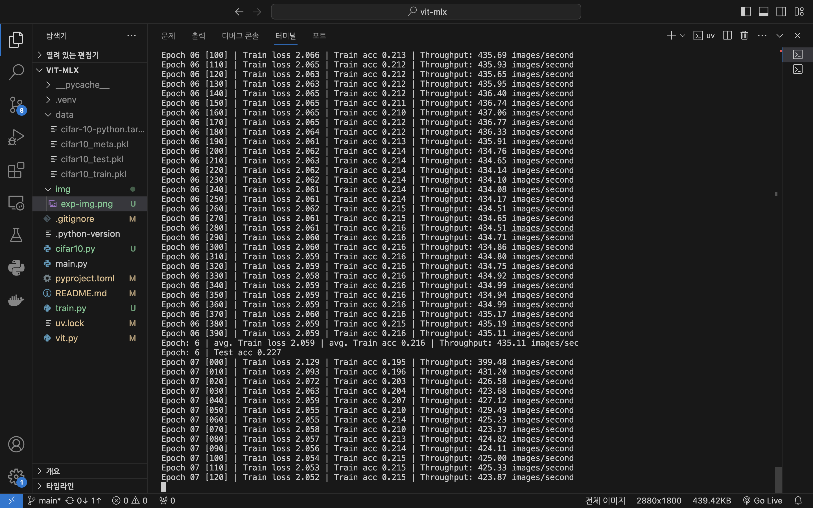
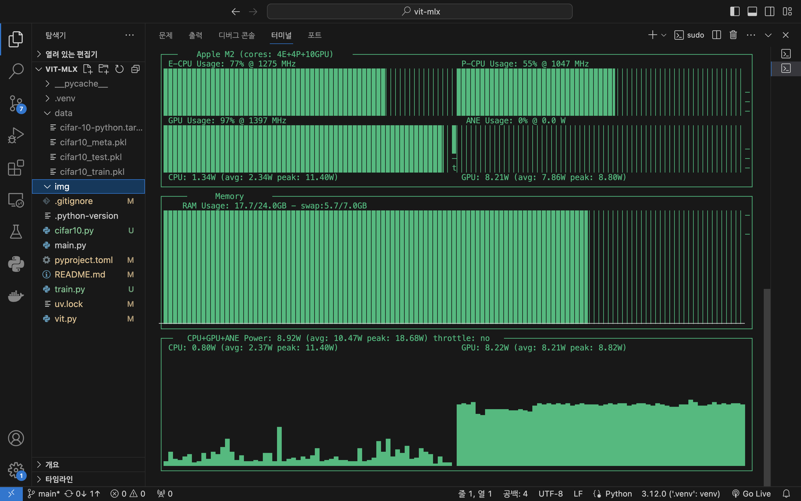

# Explore Vision Transformer with mlx

### 1. 추구미
- mlx 라이브러리를 이용하여 Vision Transformer (ViT) 만들고 탐험하기
- 한글 코드 이해하기 편하게 각 코드의 존재 이유를 적어보기

---
### 2. How to run
```
uv sync
uv run train.py
```

---

### 3. 모델 Hyper parameters
- Total trainable parameters: 5,374,282
- image size: 32
- patch size: 4
- batch size: 128
- embed_dim: 196 # ViT-Tiny-like
- num_heads: 3
- mlp_ratio=4
- dropout_rate=0.1
- depth=12
- num_classes: 10

---

### 4. 학습 Hyper parameters
- HW: Macbook M2 pro 13 inch (24Gb, 1Tb)
- epochs: 30
- optim: Adam
- lr: 1e-3
- seed: 0
- running on GPU



---
### 5. asitop
Apple Slicon 전용 (m 시리즈) GPU, CPU, RAM 모니터링 도구 asitop 결과
```
sudo asitop 
```
